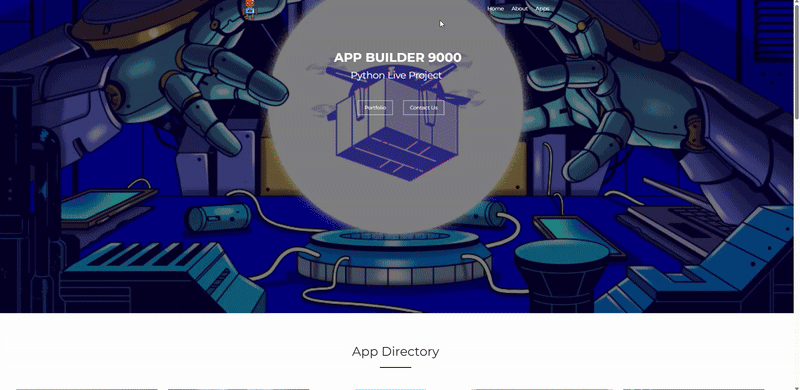
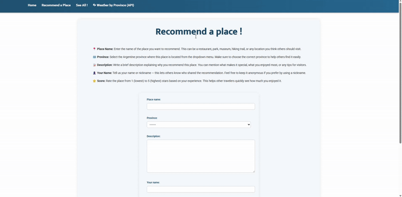
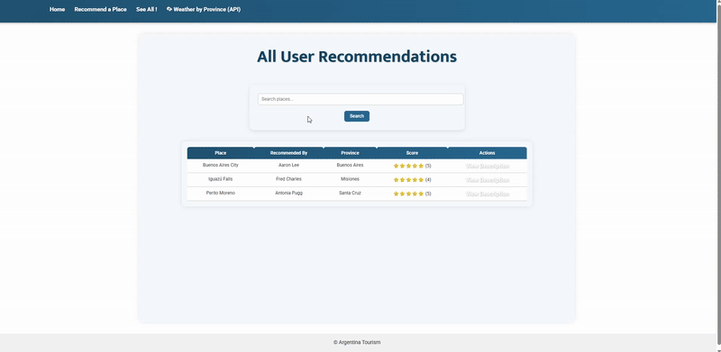
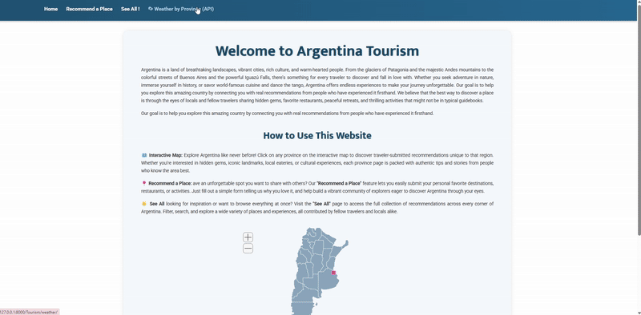

# AppBuilder9000 Project
This project is an interactive, full-stack web application built with the **Django framework** to help users manage and showcase their personal collections across various hobbies. It includes features for organizing items, browsing scraped or API-driven data, and performing full **CRUD operations** on collection entries.

The development process emphasized modern, scalable practices using **Bootstrap** customization, **responsive design**, and the **DRY principle** to maintain clean, efficient code. Debugging and development were supported through **Chrome Developer Tools**, console/terminal commands, and Django’s built-in tools.

Version control followed best practices with Git, including handling merge conflicts, pull requests, and migration resolutions. The project was managed using **Azure DevOps** within an **Agile Scrum** workflow involving daily standups and code retrospectives.

## Technologies and concepts:

- HTML, CSS, JavaScript, event listeners, imports, debugging

- PyCharm for development

- Agile methodology & Scrum practices

- API and web-scraped data integration

- Responsive UI built with Bootstrap


## Live Project Rules
- **Stories:** Complete 1–4 minimum; finishing more strengthens your portfolio.
- **Daily Updates:** Join daily stand-ups. Send progress emails to the team. 
- **Branching:** Follow naming conventions; never commit directly to main.
- **Debugging:** Test often; try solving issues yourself or with peers before asking the project director.

## Stories:


# Table of Contents
1. [Basic App Structure](#basic-app-structure)
2. [Create Model]
3. [Display All Items]
4. [Details View]
5. [Edit And Delete Functions]
6. [Connect to API]


## Project Stucture (After I finished the stories)

<pre>
Appbuilder9000/
├── .venv
├── AppBuilder9000/
│   ├── AppBuilder9000/
│   │   ├── __init__.py
│   │   ├── admin.py
│   │   ├── apps.py
│   │   ├── models.py 
│   │   ├──<a href="Python/AppBuilder9000/settings.py"> setting.py </a>
│   │   ├── test.py
│   │   ├──<a href="Python/AppBuilder9000/urls.py"> urls.py </a>
│   │   ├── <a href="Python/AppBuilder9000/views.py">views.py </a>
│   │   └── wsgi.py
│   ├── Tourism/
│   │   ├── management
│   │   ├── migrations
│   │   ├── static/
│   │   │   └── Tourism/
│   │   │       ├── css/
│   │   │       │   └──<a href="Python/Tourism/static/Tourism/css/tourism_style.css"> tourism_style.css </a>
│   │   │       ├── images
│   │   │       └── js/
│   │   │           ├──<a href="Python/Tourism/static/Tourism/js/countrymap.js"> countrymap.js </a>
│   │   │           ├──<a href="Python/Tourism/static/Tourism/js/mapdata.js"> mapdata.js</a>
│   │   │           └──<a href="Python/Tourism/static/Tourism/js/script.js"> script.js</a>
│   │   └── templates/
│   │       └── Tourism/
│   │           ├── <a href="Python/Tourism/templates/Tourism/provinces">provinces</a>/
│   │           │   ├── Buenos_Aires.html 
│   │           │   ├── Catamarca.html
│   │           │   ├── Chaco.html
│   │           │   ├── Chubut.html
│   │           │   └── [...] (total: 23 provinces)  
│   │           ├── __init__.py
│   │           ├──<a href="Python/Tourism/templates/Tourism/all_recommend.html"> all_recommend.html</a>
│   │           ├──<a href="Python/Tourism/templates/Tourism/edit_recommendation.html"> edit_recommendation.html</a>
│   │           ├──<a href="Python/Tourism/templates/Tourism/recommend.html"> recommend.html</a>
│   │           ├──<a href="Python/Tourism/templates/Tourism/recommend_success.html"> recommend_success.html</a>
│   │           ├──<a href="Python/Tourism/templates/Tourism/search_results.html"> seach_results.html</a>
│   │           ├──<a href="Python/Tourism/templates/Tourism/tourism_base.html"> tourism_base.html</a>
│   │           ├── <a href="Python/Tourism/templates/Tourism/tourism_home.html">tourism_home.html</a>
│   │           ├──<a href="Python/Tourism/templates/Tourism/view_description.html"> view_description.html</a>
│   │           └──<a href="Python/Tourism/templates/Tourism/weather_by_province.html"> weather_by_province.html</a> 
│   ├── [...](Other apps) 
│   ├── __init__py
│   ├── db.squile3
│   ├── manage.py
│   └── signin.html
├── __init__.py
├── main.py
├── README.md
└── requirements.txt
</pre>


---

## Basic App Structure


The goal of this app was to create a platform where tourists visiting Argentina could comment on their favorite places, rate them, and recommend them to other tourists.

To complete this task, I first created a new app using `manage.py startapp` and registered it in the main project’s `settings.py`. Inside the new app folder, I created a `templates` directory containing `tourism_base.html` and `tourism_home.html` templates, making sure to include the necessary block tags for template inheritance. I then added a view function in `views.py` to render the home page and set up `urls.py` for the app, registering the URLs both in the app and in the main project.

**MainApp/settings.py:**
```python
INSTALLED_APPS = [
    [...]
    'Tourism',
]
```


**MainApp/urls.py:**
``` python
urlpatterns = [
    [...]
    path('Tourism/', include('Tourism.urls'), name='Tourism'),
]
```


To link the app’s home page with the project’s main home page (`templates/index.html`), I added an image link on the Appbuilder9000 home page. Finally, I added minimal content and basic styling to the base and home templates, including a navbar, background, title, and an optional footer. The story was considered complete once the home page displayed correctly, and I tested and debugged everything to ensure it worked as expected.




## Display All Items

To complete this task, I created a new HTML page and linked it from the home page. I added a function in `views.py` that retrieves all items from the database and passes them to the template. In the template, I displayed a list of items from the database, showing selected fields for each item with appropriate labels or headers. Finally, I applied styling to the page to ensure it matched the overall design of the site.
 I also created a `forms.py` to create a form to input and edit data
```python
# Form for recommending a new place (with photo)
class PlaceRecommendationForm(forms.ModelForm):
    class Meta:
        model = PlaceRecommendation
        fields = ['place_name', 'province', 'description', 'your_name','score']
        widgets = {
            'score': forms.RadioSelect(attrs={'class': 'horizontal-radio'}),
        }
```
```python
# Handles the place recommendation form: show form on GET, save recommendation on POST
def recommendation_view(request):
    if request.method == 'POST':
        form = PlaceRecommendationForm(request.POST, request.FILES)
        if form.is_valid():
            form.save()
            return redirect('Tourism:success')
    else:
        form = PlaceRecommendationForm()
    return render(request, 'Tourism/recommend.html', {'form': form})

# Shows a success page after submitting a recommendation form successfully
def success_view(request):
    return render(request, 'Tourism/recommend_success.html')

# Shows all place recommendations saved in the database
def all_recommend(request):
    items = PlaceRecommendation.objects.all()
    return render(request, 'Tourism/all_recommend.html', {'items': items})
```    



## Edit And Delete Functions
 
In this phase, I added functionality to edit and delete recommendations saved in the database. Users could update the description, name, and rating of their favorite places. To facilitate this, I created an **"edit_recommendations.html"**  to update form elements based on the existing data. Additionally, I implemented a delete feature that allowed users to remove spots from the list. The delete action was confirmed through a popup alert, ensuring that users did not accidentally delete a recommended place.
It uses the form in `forms.py`.



## Connect to API

I decided to use an API that shows the current weather on each Argentinian province through `https://api.weatherapi.com/v1/current.json`. Added to my views.py

```python
# View for showing weather summary of all provinces:
# fetches current weather for all provinces,
# prepares list of weather data to display in template with links to province pages
def weather_by_province_view(request):
    provinces = [
        "Buenos Aires", "Ciudad de Buenos Aires", "Catamarca", "Chaco", "Chubut",
        "Córdoba", "Corrientes", "Entre Ríos", "Formosa", "Jujuy", "La Pampa", "La Rioja",
        "Mendoza", "Misiones", "Neuquén", "Río Negro", "Salta", "San Juan", "San Luis",
        "Santa Cruz", "Santa Fe", "Santiago del Estero", "Tierra del Fuego", "Tucumán"
    ]

    api_key = "e6c2f9519b8844a4945191838251207"
    weather_data = []

    for province in provinces:
        try:
            response = requests.get("https://api.weatherapi.com/v1/current.json", params={
                "key": api_key,
                "q": province,
                "lang": "en"
            })

            data = response.json()
            weather_data.append({
                "province": province,
                "slug": slugify_province(province),
                "temperature": data["current"]["temp_c"],
                "condition": data["current"]["condition"]["text"],
                "icon": data["current"]["condition"]["icon"],
                "local_time": data["location"]["localtime"],
            })
        except Exception:
            weather_data.append({
                "province": province,
                "slug": slugify_province(province),  # add slug even if error!
                "error": "Could not fetch weather data"
            })

    return render(request, "Tourism/weather_by_province.html", {"weather_data": weather_data})
 ```   

