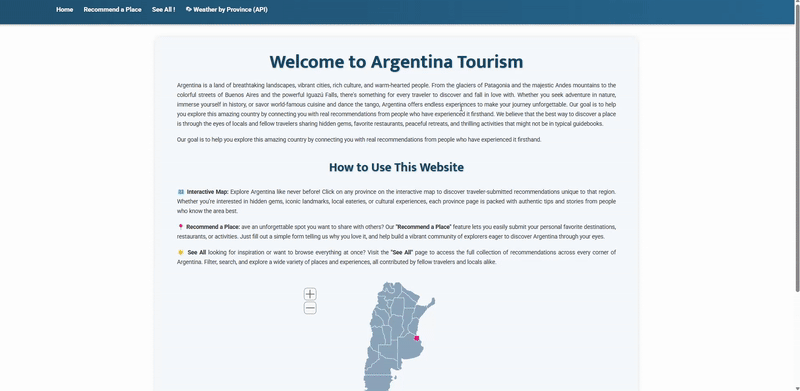

# AppBuilder9000 Project
This project is an interactive, full-stack web application built with the **Django framework** to help users manage and showcase their personal collections across various hobbies. It includes features for organizing items, browsing scraped or API-driven data, and performing full **CRUD operations** on collection entries.

The development process emphasized modern, scalable practices using **Bootstrap** customization, **responsive design**, and the **DRY principle** to maintain clean, efficient code. Debugging and development were supported through **Chrome Developer Tools**, console/terminal commands, and Django’s built-in tools.

Version control followed best practices with Git, including handling merge conflicts, pull requests, and migration resolutions. The project was managed using **Azure DevOps** within an **Agile Scrum** workflow involving daily standups and code retrospectives.



---
### Technical Overview

**Backend (Django)**
- Django models for storing recommendations
- Class-based and function-based views for CRUD operations
- Django Forms with validation and custom widgets
- URL routing at both project and app level
- Use of Django template inheritance and context rendering

**Frontend**
- Bootstrap for responsive layout and UI components
- Custom CSS for project-specific styling
- JavaScript for map interactions and enhanced UI behavior
- Template separation for scalability (base, home, recommend, weather_by_province, etc.)

**API Integration**
- Weather data retrieved using WeatherAPI /current.json endpoint

---

## Stories


### Table of Contents
1. [Basic App Structure](#basic-app-structure)
2. [Create Model](#create-model)
3. [Display All Items](#display-all-items)
4. [Edit And Delete Functions](#edit-and-delete-functions)
5. [Connect to API](#connect-to-api)


---

### Project Stucture (After I finished the stories)

<pre>
Appbuilder9000/
├── .venv
├── AppBuilder9000/
│   ├── AppBuilder9000/
│   │   ├── __init__.py
│   │   ├── admin.py
│   │   ├── apps.py
│   │   ├── models.py 
│   │   ├──<a href="AppBuilder9000/settings.py"> setting.py </a>
│   │   ├── test.py
│   │   ├──<a href="AppBuilder9000/urls.py"> urls.py </a>
│   │   ├── <a href="AppBuilder9000/views.py">views.py </a>
│   │   └── wsgi.py
│   ├── Tourism/
│   │   ├── management
│   │   ├── migrations
│   │   ├── static/
│   │   │   └── Tourism/
│   │   │       ├── css/
│   │   │       │   └──<a href="Tourism/static/Tourism/css/tourism_style.css"> tourism_style.css </a>
│   │   │       ├── images
│   │   │       └── js/
│   │   │           ├──<a href="Tourism/static/Tourism/js/countrymap.js"> countrymap.js </a>
│   │   │           ├──<a href="Tourism/static/Tourism/js/mapdata.js"> mapdata.js</a>
│   │   │           └──<a href="Tourism/static/Tourism/js/script.js"> script.js</a>
│   │   ├── templates/
│   │   │   └── Tourism/
│   │   │       ├── provinces/
│   │   │       │   ├── Buenos_Aires.html
│   │   │       │   ├── Catamarca.html
│   │   │       │   ├── Chaco.html
│   │   │       │   ├── Chubut.html
│   │   │       │   └── [...] (total: 23 provinces)  
│   │   │       ├── __init__.py
│   │   │       ├── <a href="Tourism/templates/Tourism/all_recommend.html"> all_recommend.html</a>
│   │   │       ├── <a href="Tourism/templates/Tourism/edit_recommendation.html"> edit_recommendation.html</a>
│   │   │       ├── <a href="Tourism/templates/Tourism/recommend.html"> recommend.html</a>
│   │   │       ├── <a href="Tourism/templates/Tourism/recommend_success.html"> recommend_success.html</a>
│   │   │       ├── <a href="Tourism/templates/Tourism/search_results.html"> seach_results.html</a>
│   │   │       ├── <a href="Tourism/templates/Tourism/tourism_base.html"> tourism_base.html</a>
│   │   │       ├── <a href="Tourism/templates/Tourism/tourism_home.html"> tourism_home.html</a>
│   │   │       ├── <a href="Tourism/templates/Tourism/view_description.html"> view_description.html</a>
│   │   │       └── <a href="Tourism/templates/Tourism/weather_by_province.html"> weather_by_province.html</a> 
│   │   ├── __init__.py
│   │   ├── <a href="Tourism/admin.py">admin.py </a>
│   │   ├── <a href="Tourism/apps.py">apps.py</a>
│   │   ├── <a href="Tourism/forms.py">forms.py</a>
│   │   ├── <a href="Tourism/models.py">models.py</a>
│   │   ├── <a href="Tourism/tests.py">tests.py</a>
│   │   ├── <a href="Tourism/urls.py">urls.py</a>
│   │   └── <a href="Tourism/views.py">views.py </a>      
│   ├── [...](Other apps) 
│   ├── __init__py
│   ├── db.squile3
│   ├── manage.py
│   └── signin.html
├── __init__.py
├── main.py
├── README.md
└── requirements.txt
</pre>


---

## Basic App Structure
**Goal:** Set up the foundation of the app for users to comment on, rate, and recommend locations in Argentina.

- Created a new Django app (Tourism) and registered it in <a href="AppBuilder9000/settings.py"> setting.py </a>
- Added base templates (<a href="Tourism/templates/Tourism/tourism_base.html">tourism_base.html</a> and <a href="Tourism/templates/Tourism/tourism_home.html"> tourism_home.html</a>) with block tags for inheritance
- Implemented home page view and configured URL routing
- Linked the app’s home page to the main project index
- Applied initial styling: navbar, background, title, and footer

**Example Settings & URLs:**
```python
MainApp/settings.py:

INSTALLED_APPS = [
    [...]
    'Tourism',
]


MainApp/urls.py:

urlpatterns = [
    [...]
    path('Tourism/', include('Tourism.urls'), name='Tourism'),
]
```


---

## Display All Items
**Goal:** Display and manage database content.
- Added views to fetch and display all recommendations
- Created forms for adding/editing recommendations

**Form**
```python
# Form for recommending a new place (with photo)
class PlaceRecommendationForm(forms.ModelForm):
    class Meta:
        model = PlaceRecommendation
        fields = ['place_name', 'province', 'description', 'your_name','score']
        widgets = {
            'score': forms.RadioSelect(attrs={'class': 'horizontal-radio'}),
        }
```
**Views**
```python
# Handles the place recommendation form: show form on GET, save recommendation on POST
def recommendation_view(request):
    if request.method == 'POST':
        form = PlaceRecommendationForm(request.POST, request.FILES)
        if form.is_valid():
            form.save()
            return redirect('Tourism:success')
    else:
        form = PlaceRecommendationForm()
    return render(request, 'Tourism/recommend.html', {'form': form})

# Shows a success page after submitting a recommendation form successfully
def success_view(request):
    return render(request, 'Tourism/recommend_success.html')

# Shows all place recommendations saved in the database
def all_recommend(request):
    items = PlaceRecommendation.objects.all()
    return render(request, 'Tourism/all_recommend.html', {'items': items})
```    


---

## Edit And Delete Functions
 
**Users can update or remove recommendations:**
- <a href="Tourism/templates/Tourism/edit_recommendation.html"> edit_recommendation.html</a> pre-populates form fields for easy updates
- Delete actions include confirmation prompts to prevent accidental removals


---

## Connect to API

**Goal:** Display real-time weather for each Argentine province via WeatherAPI `https://api.weatherapi.com/v1/current.json`

```python
# View for showing weather summary of all provinces:
# fetches current weather for all provinces,
# prepares list of weather data to display in template with links to province pages
def weather_by_province_view(request):
    provinces = [
        "Buenos Aires", "Ciudad de Buenos Aires", "Catamarca", "Chaco", "Chubut",
        "Córdoba", "Corrientes", "Entre Ríos", "Formosa", "Jujuy", "La Pampa", "La Rioja",
        "Mendoza", "Misiones", "Neuquén", "Río Negro", "Salta", "San Juan", "San Luis",
        "Santa Cruz", "Santa Fe", "Santiago del Estero", "Tierra del Fuego", "Tucumán"
    ]

    api_key = "e6c2f9519b8844a4945191838251207"
    weather_data = []

    for province in provinces:
        try:
            response = requests.get("https://api.weatherapi.com/v1/current.json", params={
                "key": api_key,
                "q": province,
                "lang": "en"
            })

            data = response.json()
            weather_data.append({
                "province": province,
                "slug": slugify_province(province),
                "temperature": data["current"]["temp_c"],
                "condition": data["current"]["condition"]["text"],
                "icon": data["current"]["condition"]["icon"],
                "local_time": data["location"]["localtime"],
            })
        except Exception:
            weather_data.append({
                "province": province,
                "slug": slugify_province(province),  # add slug even if error!
                "error": "Could not fetch weather data"
            })

    return render(request, "Tourism/weather_by_province.html", {"weather_data": weather_data})
 ```   


---

## Extra Styling and JS


- **Interactive Map:** An interactive map sourced from `SimpleMaps.com` was integrated to enhance the user experience. Clicking on a province redirects the user to its recommendations and displays real-time weather information.

- **Enhanced UI:** Custom JS and CSS improve interactivity and usability


---

### Live Project Rules
**Stories:** Complete 1–4 minimum; finishing more strengthens your portfolio.
**Daily Updates:** Join daily stand-ups. Send progress emails to the team. 
**Branching:** Follow naming conventions; never commit directly to `main`.
**Debugging:** Test often; try solving issues yourself or with peers before asking the project director.

---